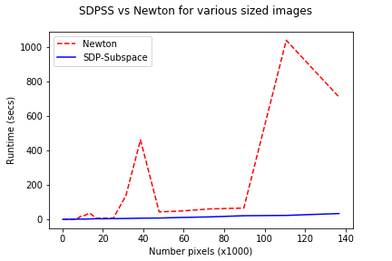

Description
-----------
This software package separates an image into disjoint subimages with similar properties (color, texture, etc.). The user may also include must-link constraints.

The new algorithm `SDPSubspaceSolver` solves the constrained image segmentation problem as described in 

* [Anders P. Eriksson, Carl Olsson, Fredrik Kahl:
Normalized Cuts Revisited: A Reformulation for Segmentation with Linear Grouping Constraints. Journal of Mathematical Imaging and Vision 39(1): 45-61 (2011)](http://www2.maths.lth.se/vision/publdb/reports/pdf/eriksson-olsson-etal-jmiv-10.pdf).  

Our subspace method is based on the following method 

* [Oliveira, Stewart, Soma: A Subspace Semidefinite Programming for Spectral Graph Partitioning](https://homepage.cs.uiowa.edu/~oliveira/PAPER2/oliveira-stew-soma-LNCS2329-02.pdf) 

with convergence theory presented in the recent papers

* [Kangal, et al: A Subspace Method for Large Scale Eigenvalue Optimization](https://arxiv.org/abs/1508.04214) and 

* [Kressner, Lu, Vandereycken: Subspace acceleration for the Crawford number and related eigenvalue optimization problems](http://sma.epfl.ch/~anchpcommon/publications/crawford_preprint.pdf)

For a draft of the paper describing the method used in `SDPSubspaceSolver`, please contact me.

### New Contributions:

* More efficient method for image segmentation eigenvalue problem

   * Requires 50% to 95% fewer flops than the previous `NewtonEigSolver` method of Eriksson, Olsson, Kahl.

   * Avoids potentially ill-conditioned generalized eigenvalue problems, instead solving well-conditioned standard eigenvalue problems (see runtime spikes for `NewtonEigSolver` below).

* New sparse method for computing adjacency matrix

   * Computes the pixel adjacency matrix in `O(n)` flops, where `n` is the number of pixels.  The current method in [`scikit-image`](https://github.com/scikit-image/scikit-image/blob/master/skimage/future/graph/rag.py) requires `O(n^2)` flops.

Demo Tutorial
-------------

The following results demonstrate that our method `SDPSubspaceSolver` is more efficient than the previous method `NewtonEigSolver` for image segmentation proposed by Eriksson, Olsson, Kahl.

To run this demo, call the function `RunDemo.main()` (dependencies listed below). 

 

Original image

Segmented regions

Contents
--------

Main function:

* `./ImSeg.py`: takes an image and possible link constraints as inputs. Segments the image into disjoint subimages. Returns an array of disjoint subimages.

Key files and folders:

* `./src/SDPSubspaceSolver/*`: our new method which solves the image segmentation eigenvalue problem as a subspace SDP (semidefinite program).  

* `./src/NewtonEigSolver/*`: an implementation of the original Newton method for the image segmentation problem by Eriksson, et al.

* `./src/GetAdjMat.py`: sparse method to compute the pixel adjacency matrix in `O(n)` flops, where `n` is the number of pixels.  

* `./test/`: contains test images and prototyping files.

Python Dependencies
-------------------
* `Tkinter`
* `PIL`
* `cvxopt`
* `matplotlib`, `numpy`, `scipy`

Additional Comments
-------------------

* The original non-constrained image segmentation method is [Jianbo Shi, Jitendra Malik:
Normalized Cuts and Image Segmentation. IEEE Trans. Pattern Anal. Mach. Intell. 22(8): 888-905 (2000)](https://www2.eecs.berkeley.edu/Research/Projects/CS/vision/grouping/papers/sm_pami00.pdf)

* I am also examining another eigenvalue method which should solve the image segmentation problem as one single, evolving eigenvalue problem rather than a sequence of eigenvalue problems.  This new method will likely be much faster than both the methods implemented in this repository.  This method is based on the eigenvalue method [Golub, Ye: An Inverse Free Preconditioned Krylov Subspace Method for Symmetric Generalized Eigenvalue Problems](https://epubs.siam.org/doi/abs/10.1137/S1064827500382579) and is similar to the evolving matrix strategy used in [Saad: Analysis of Subspace Iteration for Eigenvalue Problems with Evolving Matrices](https://www-users.cs.umn.edu/~saad/PDF/ys-2014-1.pdf)

