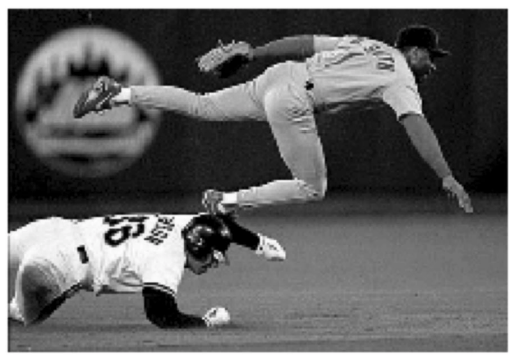
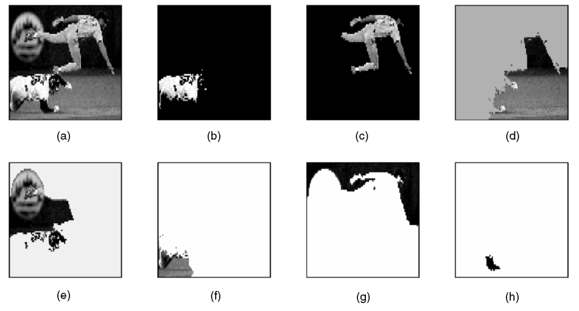

Description
-----------
This software package separates an image into `k` disjoint subimages with similar properties (color, texture, etc.).

Note: this package is still in development. When completed, it will perform the following functions:

1. Unsupervised learning of image segments
   - `inputs`: image, number `k` of requested subimages.
   - `outputs:` `k` subimages as demonstrated below:

 

Original image.

Processed image: (a) image resized to 80 x 100, (b-h) resulting segments.

Method and results are based on work from [Jianbo Shi, Jitendra Malik:
Normalized Cuts and Image Segmentation. IEEE Trans. Pattern Anal. Mach. Intell. 22(8): 888-905 (2000)](https://www2.eecs.berkeley.edu/Research/Projects/CS/vision/grouping/papers/sm_pami00.pdf)

2. Semi-supervised learning of image segments 
   - `inputs`: image, grouping contraints on pixels, number `k` of requested subimages.
   - `outputs:` `k` subimages as demonstrated below:

Method and results are based on work from [Anders P. Eriksson, Carl Olsson, Fredrik Kahl:
Normalized Cuts Revisited: A Reformulation for Segmentation with Linear Grouping Constraints. Journal of Mathematical Imaging and Vision 39(1): 45-61 (2011)](http://www2.maths.lth.se/vision/publdb/reports/pdf/eriksson-olsson-etal-jmiv-10.pdf)

Contents
--------

Main function:

* `./ImSeg.py`: takes an image and an integer `k` as inputs. Segments the image into `k` disjoint subimages. Returns an array of the `k` disjoint subimages. 
   - Status: not done

Source files:

* `./src/GetAdjMat.py`: computes the pixel adjacency matrix in `O(n)` flops, where `n` is the number of pixels.  The current method in `scikit-image` requires `O(n^2)`.
   - Status: not done.  Need to finish coding binary ops on adjacency relations.

* `./src/SolveSDPwithCvxopt.py`: transforms SDP (semidefinite program) into  appropriate model format and solves it with `cvxopt` optimization package.
   - Status: done

* `./src/SDPSubspaceSolver.py`: solves normalized cuts eigenvalue problem as a subspace SDP.  Requires 50% to 80% fewer flops than first-order methods.  
   - Status: not done

* `./test/`: contains test images and prototyping files for use in finishing package.

Python Dependencies
-------------------
* `Tkinter`
* `PIL`
* `cvxopt`
* `numpy`, `scipy`

